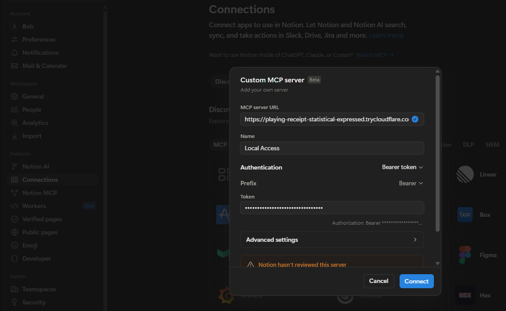

# MCP (Local Access)

The MCP server lets cloud services with MCP support, for example Notion AI,
get access to **a single folder** on your computer: read files, search through
them, edit, create and delete them, and also run allowed commands.

The MCP server is the "hands", the cloud service is the "brain".
Instead of copying code into the chat and back, MCP lets you work with the files on your PC.

**Why you need it**

- The AI chat sees the real project, not a retelling of it: exact files, exact lines.
- Edits are applied to the files right away, with a diff in the response.
- You set the boundaries: one root folder, a list of forbidden paths, a whitelist
  of commands and, if you want, a "read-only" mode.

**Status.** The version was developed for Windows and macOS, but has actually been
tested only on Windows; the macOS/Linux branches are written but not verified.



---

## Contents

1. [How it works](#1-how-it-works)
2. [Project structure](#2-project-structure)
3. [Requirements](#3-requirements)
4. [Installation](#4-installation)
5. [Configuration](#5-configuration)
6. [Running and publishing](#6-running-and-publishing)
7. [Connecting a client](#7-connecting-a-client)
8. [JSON setup, using accio.com as an example](#8-json-setup-using-acciocom-as-an-example)
9. [Tools](#9-tools)
10. [Rules.md — a short description of your project](#10-rulesmd--a-short-description-of-your-project)
11. [Permissions](#11-permissions)
12. [Limits](#12-limits)
13. [Security](#13-security)
14. [Troubleshooting](#14-troubleshooting)
15. [FAQ](#15-faq)

---

## 1. How it works

```
Notion AI / claude.ai / chatgpt
        │  HTTPS + Bearer token
        ▼
cloudflared tunnel  or  your own web server with TLS
        │  HTTP inside the local network
        ▼
server.py  (listens on host:port, serves /mcp)
        │  every path is checked: sandbox + permissions
        ▼
rootDir — the only folder that is accessible
```

Stack: Python + the MCP SDK for Python (FastMCP) + uvicorn, Streamable HTTP
transport on the `/mcp` path, Bearer-token authorization. The server knows nothing
about how it is published: it simply listens on `host:port`, and how that port
ended up on the internet is the business of the tunnel or the proxy.

## 2. Project structure

| Path | What it is |
| --- | --- |
| `server.py` | the whole server: config, path sandbox, permissions, tools, authorization |
| `config.json` | the settings file, create it from `config.example.json` |
| `config.example.json` | settings template |
| `.env` | the file stores the `MCP_TOKEN` token, which is generated on the first run of `server.py` |
| `requirements.txt` | three dependencies: `mcp`, `uvicorn`, `python-dotenv` |
| `README.md` | this file |
| `Rules.md` | basic instructions for the AI, so that it knows the minimal context of your project |
| `logs/` (inside `rootDir`) | `cmd-NNN.log` — command output, `audit.log` — action journal, `processes.json` — process registry |

## 3. Requirements

- Python 3.10 or newer (`python --version`).
- A way to expose the local port to the outside over HTTPS — one of two options:
  - **cloudflared**, if you do not have your own web server:
    - Windows: `winget install Cloudflare.cloudflared`
    - macOS: `brew install cloudflared`
  - **your own reverse proxy with TLS** (based on Nginx, Caddy, Traefik) in front of that port.

On the first run `server.py` generates the token itself; a Cloudflare account setup
is not needed for this task, cloudflared handles it on its own.

## 4. Installation

```bash
cd local-access
python -m venv .venv

# Windows
.venv\Scripts\activate

# macOS / Linux
source .venv/bin/activate

pip install -r requirements.txt
```

## 5. Configuration

All settings live in `config.json`. Copy the template and adjust it:

```bash

# Windows
copy config.example.json config.json

# macOS / Linux
cp config.example.json config.json
```

```json
{
  "rootDir": "C:/usr/mcp/local-access",
  "host": "0.0.0.0",
  "port": 8000,
  "readOnly": false,
  "jsonResponse": false,
  "rulesFile": "Rules.md",
  "logDir": "logs",
  "audit": true,
  "maxCommandTimeout": 600,
  "permissions": { "...": "see section 11" }
}
```

| Key | Meaning |
| --- | --- |
| `rootDir` | The only folder the server has access to. Everything outside it is rejected. Required parameter. |
| `host` | The interface to listen on. `0.0.0.0` by default — suitable both for a tunnel on this machine and for a proxy on another host. `127.0.0.1` — accept local connections only. |
| `port` | The local port; the tunnel or proxy points here. 8000 by default. |
| `readOnly` | `true` disables `edit_file`, `multi_edit`, `create`, `delete`, `move` and `run_command`. |
| `jsonResponse` | `true` is only needed for a client that cannot handle SSE responses. |
| `rulesFile` | Path to the guide file for the model. Optional, see section 10. |
| `logDir` | A folder inside `rootDir` for command logs and the action journal. `logs` by default. |
| `audit` | `false` turns off `logs/audit.log`. `true` by default. |
| `maxCommandTimeout` | Upper bound for the `timeout` of `run_command`, in seconds. 600 by default. |
| `permissions` | Rules for paths and commands, see section 11. |

`.env` holds only the secret token:

```bash
# Windows
copy .env.example .env

# macOS / Linux
cp .env.example .env
```

Leave `MCP_TOKEN` empty: on the first run the server will generate a token and
write it into that same line. To change the token, clear the value and restart
the server.

## 6. Running and publishing

You need two terminals.

**Terminal 1 — the server:**

```bash
python server.py
```

It prints the endpoint, the token and the effective rules:

```
  local-mcp v0.1
  root      : C:\usr\mcp\my-project
  endpoint  : http://0.0.0.0:8000/mcp
  token     : 3f8c1d...
  read-only : no
  rules     : C:\usr\mcp\local-mcp-v0.1\Rules.md
  logs      : C:\usr\mcp\my-project\logs (audit.log: last 300 lines)
  processes : adopted 1, cleaned 4 old log(s)
  config    : C:\usr\mcp\local-mcp-v0.1\config.json
  perms     : defaultMode allow
    allow : List(**), Read(**), Edit(**), Create(**), Delete(**)
    deny  : *(**/.env), *(**/.env.*), *(**/config.json), *(**/secrets/**)
    run   : Run(npm run dev), Run(npm run build), Run(git status)

  WARNING: the server is listening on the whole local network.
  For a tighter setup set "host": "127.0.0.1" in config.json.
```

### Option A — a quick cloudflared tunnel

**Terminal 2:**

```bash
cloudflared tunnel --url http://localhost:8000 --protocol http2
```

After it starts you can see the public address in the terminal:

Requesting new quick Tunnel on trycloudflare.com...
+--------------------------------------------------------------------------------------------+
|  Your quick Tunnel has been created! Visit it at (it may take some time to be reachable):  |
|  https://verbal-univ-silent-bracelet.trycloudflare.com                                     |
+--------------------------------------------------------------------------------------------+

In this case it is `https://verbal-univ-silent-bracelet.trycloudflare.com`.
Note that the URL changes after every start.


- `--protocol http2` forces the tunnel to work over TCP instead of QUIC/UDP. Without
  this flag the connection can drop with `timeout: no recent network
  activity`, and requests can fail with Cloudflare error 1033.
- The tunnel does not have to be restarted together with the server: it forwards
  `localhost:8000`, and as long as the port stays the same, the public address keeps
  working. A restart is only needed if you changed `port` or the tunnel died itself.
- The address of a quick tunnel changes on every cloudflared start — which means
  you will have to update the URL in the client.

### Option B — using a web server in front of the server (a permanent address)

For this option you need to have:
- a static external IP address
- a web server with TLS where you can configure a reverse proxy
- a domain; for mcp you can use a third-level domain
- a certificate obtained so that https works


In `config.json`:

- `"host": "0.0.0.0"` — the default value and what the proxy needs: on
  `127.0.0.1` the server is reachable only from this machine.
- `"port": 8000` — or any free port the proxy points to.
- After editing the file, restart `server.py` and check the `endpoint` line.

On the proxy host you only need `location /mcp` — the public path is the proxy's
business, the server always serves `/mcp`.
An example reverse-proxy configuration for Nginx:

```nginx
server {
    listen 443 ssl;
    server_name mcp.example.com;

    location /mcp {
        proxy_pass http://192.168.1.50:8000/mcp;   # the machine where server.py runs
        proxy_http_version 1.1;
        proxy_set_header Host $host;
        proxy_buffering off;              # SSE must be streamed, not buffered
        proxy_request_buffering off;
        proxy_read_timeout 3600s;
        chunked_transfer_encoding on;
    }
}
```

- The key lines are `proxy_buffering off` and `proxy_request_buffering off`:
  the transport streams SSE, and a buffering proxy hangs every response until
  the timeout.
- The `Authorization` header passes through unchanged, the token arrives as is.
- The server rewrites the `Host` header itself, so the SDK's DNS-rebinding
  protection does not require extra headers (there will be no 421 errors).
- TLS is terminated on the proxy, plain HTTP goes to the server inside the local network.

After that the address is permanent: `https://mcp.example.com/mcp` is entered into
the client once and survives restarts of both the server and the proxy.

## 7. Connecting a client

**Notion** (Settings → Connections → add an MCP server):

- URL: `https://your-address/mcp` — the `/mcp` suffix is mandatory
- Authentication: Bearer token, prefix `Bearer`, the token itself — from terminal 1

## 8. JSON setup, using accio.com as an example

Some services let you add an MCP server as a single JSON block instead of
filling in form fields. In accio.com, for example: Settings → MCP → the
**Custom** section → the **Add custom MCP** button (or “+ Add”) → the
**Add Custom MCP Server** dialog. The dialog has four Configuration Mode tabs:
`JSON | Stdio (Local) | HTTP | SSE`. Open the **JSON** tab and paste this text:

```json
{
  "mcpServers": {
    "Local Access": {
      "type": "http",
      "url": "https://your-host.example.com/mcp",
      "headers": {
        "Authorization": "Bearer YOUR_TOKEN"
      }
    }
  }
}
```

Then replace the default values with your own:

- `url` — the address of your tunnel or domain; the `/mcp` suffix is mandatory
- `Authorization` — the `Bearer` prefix and your token (`MCP_TOKEN` from `.env`,
  the server prints it on startup)

The `Local Access` key is just the connection name shown in the interface, so
you can change it. The same JSON works with any client that accepts an
`mcpServers` configuration.

## 9. Tools

All paths in the arguments are relative to `rootDir`. Absolute paths are
rejected, as are symlinks leading outside the root.

### The guide

| Tool | What it does |
| --- | --- |
| `project_guide()` | Returns `Rules.md`: the project context and the working rules |

The same text is automatically appended to the first tool result in a
conversation, so usually there is no need to call it.

### Files

| Tool | What it does |
| --- | --- |
| `list_files(path, recursive, max_depth)` | Directory listing; `recursive` includes nested folders |
| `read_file(path, offset, limit)` | The file with line numbers, page by page for large files |
| `search_text(pattern, path, glob, regex, case_sensitive, context, max_results)` | Search across the project, returns `path:line: text` |
| `file_info(path)` | Size, line count, modification time, text or binary |
| `edit_file(path, old_string, new_string, replace_all)` | Exact replacement, returns a diff |
| `multi_edit(path, edits, regex)` | Several replacements in one file, all or nothing |
| `create(path, type, content, overwrite)` | A new file or folder |
| `move(source, destination, overwrite)` | Rename or move |
| `delete(path, recursive)` | Permanent deletion of a file or folder |

- Noise folders (`node_modules`, `.git`, `dist`, `build`, `.venv`, `venv`,
  `__pycache__`, `.next`, `.idea`) are always skipped in listings and searches.
- `delete` has no trash: a non-empty folder requires `recursive=true`, the root
  itself cannot be deleted, and a folder containing a file forbidden by the rules
  is not deleted as a whole.
- `move` requires `Delete` permission on the source and `Create` on the destination,
  so a protected file cannot be taken out from under its protection by moving it.
- One file should not be edited by two calls at the same time: `edit_file` and
  `multi_edit` read and write the file as a whole, parallel calls overwrite each
  other.

### Commands

| Tool | What it does |
| --- | --- |
| `run_command(command, cwd, timeout, background, wait_for, idle_timeout, restart)` | Runs a command inside `rootDir` |
| `list_processes()` | Everything started in this session: alive and finished |
| `check_process(id, lines, wait, wait_for)` | The state and fresh output of a single process |
| `stop_process(id, stop_all)` | Kills a process together with its children |

- Commands go through the system shell, so `&&`, `||`, `|` and `;` work.
  Every link of the chain is checked against the `Run(...)` rules separately, and a
  command without a matching rule is rejected.
- A command must be a single line: a newline is a command separator, so a
  multi-line string would only be executed partially. Join the steps with `&&`
  or put them into a script.
- `background=false` (the default) — for commands that finish: the call
  returns the exit code and the output, and after that the process is guaranteed to be
  dead. On timeout the whole process tree is killed.
- `background=true` — for long-living commands such as `npm run dev`. The process stays
  alive after the call; when control is returned is decided by `wait_for` (a regular
  expression) or `idle_timeout`, for example `wait_for: "ready in|listening on"`.
- The output is streamed into `logs/cmd-NNN.log` instead of being kept in memory, so a noisy
  build will not blow up the response. Long output is returned as the beginning and the tail.
- Every started process is tracked, and a short `[processes]` block is
  appended to **any** tool result while something is running or has
  just finished:

```
[processes]
  #1 running   npm run dev  (pid 24188, 96s, log logs/cmd-001.log)
  #2 exited (exit 0)  npm run build  (log logs/cmd-002.log)
```

  This is how the model stays aware of the terminal: an MCP server cannot send a
  notification into the model's turn by itself, so the state is supplied again
  as context on the next call.
- Starting a command that is already running is rejected with a reference to its number;
  `restart=true` stops the old process first.
- The output is forced to UTF-8 (`chcp 65001` on Windows,
  `PYTHONIOENCODING`, `NO_COLOR`), so that logs do not turn into garbled characters.
- Processes are killed as a tree (`taskkill /T` on Windows, the whole process group
  on macOS/Linux, `SIGTERM` first, then `SIGKILL`), because the port is held not by
  `npm` but by its child `node`.
- When the server exits, all started processes are stopped, so `Ctrl+C`
  does not leave hanging dev servers behind.
- The process registry is duplicated in `logs/processes.json`. A hard kill of the server
  (a closed console, the task manager) does not run the cleanup and leaves the children
  alive, so on start every entry is checked against the OS: a live pid is
  adopted back into the registry and shown as `running (adopted)`,
  everything else is considered finished, and their `cmd-NNN.log` files are deleted. Numbers
  keep growing, so log names do not conflict. An adopted process
  can be inspected and stopped as usual — only the exact exit code is lost,
  because the server no longer owns its handle.

### The action journal

With `"audit": true` every command, move and `multi_edit` is appended to
`logs/audit.log`:

```
2026-09-15 03:40:12 ok  run_command: #1 npm run dev (cwd .)
2026-09-15 03:41:02 ok  move: src/old.ts -> src/new.ts
```

This is the answer to the question "what did the model actually do" — useful after a long
session or when something broke and the diff is not enough. Add `logs/` to
`.gitignore`.

The journal is a sliding tail, not an archive: it is trimmed to the last 300 lines
(`AUDIT_KEEP_LINES` in `server.py`) on start and every 100 entries, so it cannot grow
indefinitely. Command logs are cleaned separately: on start every
`logs/cmd-NNN.log` whose process is neither alive nor adopted is deleted.

## 10. Rules.md — a short description of your project

`Rules.md` is an (optional) file; describe your project briefly in it,
or you can point to the documentation files of your project.
The idea is simple — not to explain the details of the project to the model in every new conversation.

- The file name and its path can be changed in the `rulesFile` variable
  in `config.json`. If the variable is not set, the `Rules.md` file
  located in the folder specified in `rootDir` is used.
- The file is re-read when it changes, a restart is not needed: the new text arrives with
  the next tool result and in the client's next session.

## 11. Permissions

The rules live in the `permissions` block of `config.json` and are written in the
Claude Code style: `Tool(glob-path)`.

```json
{
  "permissions": {
    "defaultMode": "allow",
    "allow": ["List(**)", "Read(**)", "Edit(**)", "Create(**)", "Delete(**)"],
    "deny": [
      "*(**/.env)",
      "*(**/.env.*)",
      "*(**/config.json)",
      "*(**/secrets/**)",
      "*(**/*.pem)",
      "*(**/*.key)",
      "Edit(**/.git/**)",
      "Create(**/.git/**)",
      "Delete(**/.git/**)"
    ]
  }
}
```

- The verbs: `List`, `Read`, `Edit`, `Create`, `Delete`, `Run` or `*` for all
  path verbs. How they map to the tools: `List` and `Read` together determine
  what `list_files` shows; `Read` also covers `search_text` and `file_info`;
  `Edit` covers `multi_edit`; `Create` — `create` and the destination of `move`; `Delete` —
  `delete` and the source of `move`.
- `Run` stands apart: its argument is a command pattern, not a path, so
  `*(**)` never grants it. See "Rules for commands" below.
- `defaultMode: "allow"` — everything that is not forbidden is allowed (a blacklist).
- `defaultMode: "deny"` — only the paths from `allow` work (a whitelist).
- **`deny` is always stronger than `allow`.**
- The patterns are defined relative to `rootDir`, the separator is `/`, and
  `*` (one segment), `**` (any depth) and `?` (one character) are supported.
- The patterns are anchored to the root, so `.env` matches **only** the file in
  the root. To cover all subfolders you need the `**/` prefix — `**/.env`.
- `secrets/**` hides the `secrets` folder itself as well.
- Forbidden entries are not shown in `list_files`; the number of hidden entries
  is printed instead.
- If there is no `permissions` block, the built-in values apply: everything is allowed
  except `**/.env`, `**/.env.*`, `**/secrets/**`, `**/*.pem`, `**/*.key`, plus
  a ban on writing and deleting inside `**/.git/**`.
- The rules are read on start — restart the server after editing them.
- `*(**/config.json)` closes access to the file for the model, so that it cannot rewrite
  its own permissions.


### Rules for commands

Commands are always a whitelist. `Run(...)` accepts a command pattern where `*`
means any text; everything else is compared literally, whitespace is
collapsed, and case is ignored. If there is not a single `Run` rule,
`run_command` refuses everything.

```json
{
  "permissions": {
    "allow": [
      "Run(npm run dev)",
      "Run(npm run build)",
      "Run(npm install)",
      "Run(git status)",
      "Run(git diff*)",
      "Run(python *)",
      "Run(pytest*)"
    ],
    "deny": ["Run(*rm -rf*)"]
  }
}
```

- The chain is split on `&&`, `||`, `|`, `;` and newlines, and every segment
  must match a rule from `allow` on its own. For `npm run build && git status`
  both rules are needed; `npm run build && rm -rf /` fails on the second segment.
- The splitting respects quotes, so `git commit -m "fix | bug"` is a single segment.
- `deny` is stronger here too, and `defaultMode: "allow"` does **not** extend to
  commands.

**How much security does this provide.** Not much, and that is a deliberate trade-off.
A whitelist saves you from accidents and typos, not from a targeted attack: a single
allowed `python *` or `npm run *` is enough to do anything an ordinary program
can do, including getting outside `rootDir` — the path sandbox restricts
only the file tools, never a child process. Keep the list
short and specific and treat running commands as "I trust this
client with my user account", not as a sandbox.

An example whitelist: read only `src` and Markdown, write only to
`src/generated`:

```json
{
  "permissions": {
    "defaultMode": "deny",
    "allow": ["List(src/**)", "Read(src/**)", "Read(*.md)", "Create(src/generated/**)", "Edit(src/generated/**)"]
  }
}
```

## 12. Limits

Hardcoded in `server.py` (constants at the top of the file), changed by editing the code:

| Limit | Value |
| --- | --- |
| Size of a single response | 100,000 characters, truncated beyond that |
| Reading/writing file content | 1 MB |
| Entries in a listing | 1000 |
| Timeout of a synchronous command | 60 s by default, maximum — `maxCommandTimeout` (600 s) |
| Waiting for a background command | `idle_timeout` 15 s by default |
| Simultaneous background processes | 8 |
| Command output in one response | 20,000 characters |
| A finished process in the registry | 10 minutes |
| `audit.log` | last 300 lines |
| `Rules.md` | 20,000 characters |

## 13. Security

- Anyone who has the public URL **and** the token can read, change and delete
  inside `rootDir` — everything that is not closed by the `deny` rules.
- `run_command` is the widest hole: a child process is not bound by the path
  sandbox, so allowed `python *`, `node *` or `npm run *` can reach
  everything your user account can reach. Keep the `Run` list
  short.
- Stop background processes when you are done (`stop_process(stop_all=true)`);
  stopping the server with `Ctrl+C` kills them too. A hard kill does not, but on
  the next start live processes are adopted back.
- Turn the tunnel off when you do not need it.
- The token is changed like this: clear `MCP_TOKEN` in `.env` and restart the server.
- Keep `rootDir` as narrow as the task allows: a parent
  folder pulls this very project together with its `.env` into the sandbox.

**If you need it stricter:** enable call confirmation on the client side, narrow
`rootDir`, set `"readOnly": true` or remove all `Run` rules.

## 14. Troubleshooting

| Symptom | Cause |
| --- | --- |
| `rootDir is not set` | There is no `config.json`, or `rootDir` is not set in it |
| 401 from the client | The token does not match, or the header is not named `Authorization` |
| 421 `Invalid Host header` | An old `server.py` without the `Host` rewrite |
| 406 Not Acceptable | The client did not send the `Accept` header shown in section 8 |
| Cloudflare 1033 | The tunnel lost its connection; restart it with `--protocol http2` |
| The client does not see any tools | The URL is missing the `/mcp` suffix |
| A new tool did not appear | The client cached the old list; reconnect the connector |
| Responses hang until the timeout | The proxy buffers SSE: `proxy_buffering off` |
| `Permission denied` | The path matched a `deny` rule in `config.json` |
| `Permission denied: Run(...)` | No `Run` rule matched the command or a link of the chain |
| `Already running as #N` | The same command is still alive: inspect it, stop it or pass `restart=true` |
| `Timed out after Ns` | A long-living command was started without `background=true` |
| `command must be a single line` | Newlines separate commands; join the steps with `&&` |
| `Absolute paths are not allowed` | That is by design: paths are relative to `rootDir` |

## 15. FAQ

**What if I want several rootDirs?**

One process — one root, that is the basis of the sandbox. The options:

- Point to a common parent folder and narrow the access with permissions, for example
  `List(project-a/**)`, `Read(project-a/**)`, `Edit(project-a/**)` and the same for
  `project-b`. Simple and it works, but everything sits in one sandbox.
- Run a second instance of the server with its own config and port: the path to the config
  is taken from the `CONFIG_FILE` variable, and the port — from the config itself.

  ```bash
  CONFIG_FILE=/path/to/config-b.json python server.py     # macOS / Linux
  set CONFIG_FILE=C:\path\to\config-b.json && python server.py   # Windows
  ```

  Every instance needs its own public address (a second tunnel or a second
  `location` in Nginx) and its own connection in the client. The token is taken from the `.env`
  next to `server.py`, so different tokens require different copies of the project.

**Is cloudflared mandatory?**

No. You need any way to expose the port to the outside over HTTPS: your own Nginx/Caddy/Traefik,
a named Cloudflare tunnel, any other tunnel. The server knows nothing about
it.

**Can I do without publishing to the outside?**

Notion and claude.ai work over the internet, they need a public HTTPS address.
Local clients (Cursor and others running on the same machine) can
connect directly to `http://127.0.0.1:8000/mcp` — in that case set
`"host": "127.0.0.1"`.

**Can the model get outside rootDir?**

With the file tools — no: absolute paths are rejected, `..` is resolved,
symlinks pointing outside are discarded. Through `run_command` — yes: a child process is
not restricted by the sandbox. If that is unacceptable, do not give any `Run` rules or
enable `readOnly`.

**How do I forbid any changes at all?**

`"readOnly": true` — only reading, searching and listing remain. An intermediate
option: keep `Edit`/`Create` for the working folder and forbid the rest through
`deny`.

**Is Rules.md required?**

No, the server works without it too. But with it you do not have to explain in every new
conversation what this project is and how things are done in it. See section 10.

**Does this work on macOS and Linux?**

The code is there (`/bin/sh`, `start_new_session`, killing the process group), but it has been
tested only on Windows. Consider the first run on macOS/Linux a test one.

**The model deleted a file I needed — how do I roll back?**

There is no way with the server's own means: there is no trash, deletion is permanent. Keep the project under
git, and in `logs/audit.log` you can look at what exactly happened.
It is recommended to set up a project backup before every new task.

**Why does the client ask for confirmation on every call?**

That is the client's behaviour, the server does not affect it. In Notion the confirmations
are configured in the connection properties; the server's permissions work independently of
what you clicked.

**The token leaked. What should I do?**

Clear the `MCP_TOKEN` value in `.env`, restart the server (it will generate
a new token), and enter the new token into the client. The old one stops working immediately.

**Why is `logs/` inside rootDir and not next to the server?**

So that the model can read the command output itself via `read_file`. A side
effect: add `logs/` to `.gitignore`.
